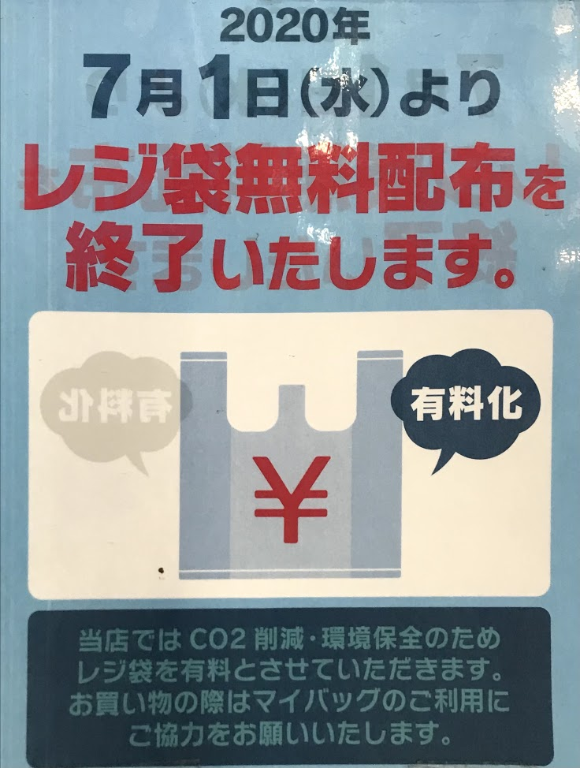
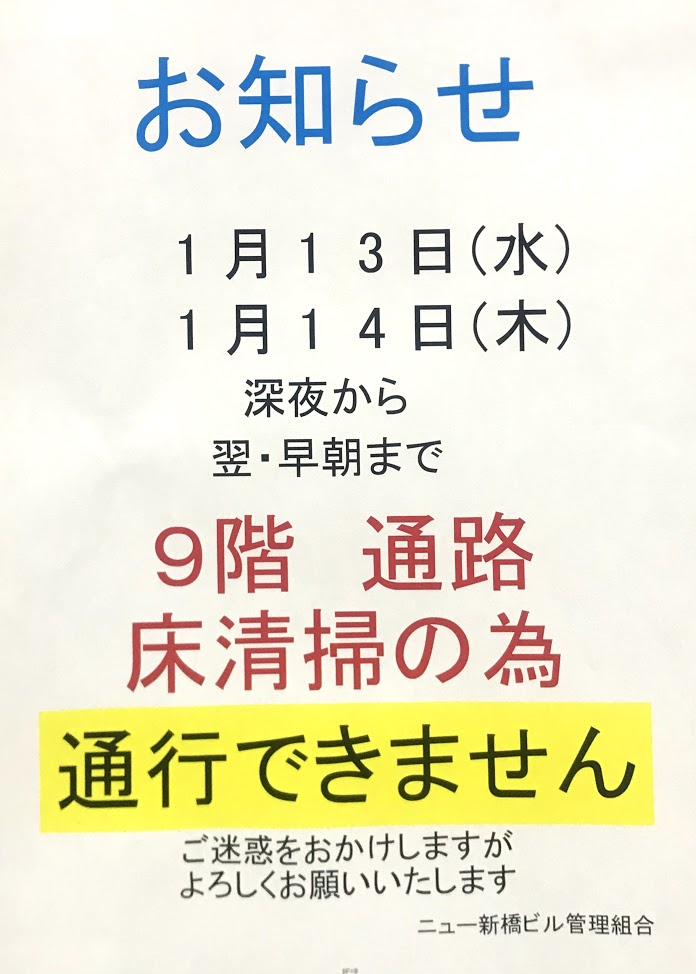

# Learning Japanese with posters

**Poster 1:**\
農林水産省　令和2年度　Go To Eatキャンペーン　に係る事務のうち　食事券発行委託事務\
Bộ nông lâm thủy sản, Lệnh Hòa năm thứ 2, về việc ủy thác phát hành phiếu ăn, liên quan đến chương trình Go To Eat:\
のうりんすいさんしょ　ー　かかるじむのうち　ー　しょくじけんはっこういたくじむ\
プリミアム付食事券\
プリミアムつき　ー　liên quan tới premium\
見本　ー　みほん　ー　sample\
加盟店　ー　かめいてん　ー　Gia Minh Điếm (những quán ăn có tham gia chương trình này)\
食事券使えます　ー　có thể xài được phiếu ăn này\

**Poster 2:**\
７月１日（水）より\
レジ袋無料配布を終了いたします（有料化）\
Từ ngày 1 tháng 7, sẽ chấm dứt việc phân phát miễn phí túi nhựa (tính tiền)\
終了ーしゅうりょうー Chung Liễu - kết thúc\
当店ではCO2削減、環境保全のため、レジ袋を有料とさせていただきます。\
Ở tiệm chúng tôi, để cắt giảm khí CO2 bảo vệ môi trường, sẽ bắt đầu việc tính phí các túi nhựa.
削減ーさくげんーTước Giảm - cắt giảm\
保全ーほぜんーBảo Toàn\
Xem sự khác nhau giữa 保全、保護、維持 ở đây(https://www.eic.or.jp/qa/?act=view&serial=642)

お買い物の際はマイバッグのご利用にご協力お願いいたします。\
Lúc mua đồ, xin vui lòng dùng túi My Bag.

