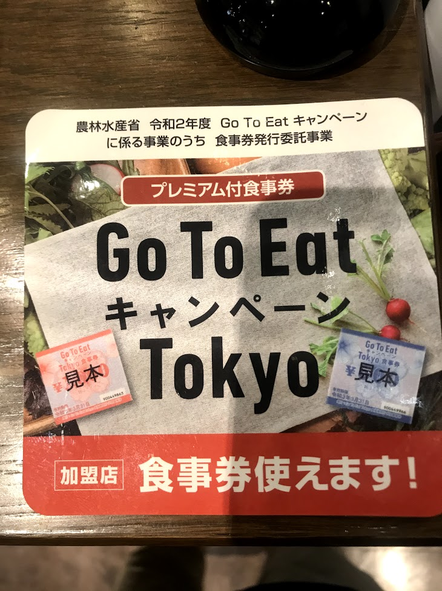

# Learning Japanese with posters

**Poster 1:** Thông báo về việc bán phiếu ăn ở Ginza Lion\
農林水産省　令和2年度　Go To Eatキャンペーン　に係る事業のうち　食事券発行委託事業\
Bộ nông lâm thủy sản, Lệnh Hòa năm thứ 2, về việc ủy thác phát hành phiếu ăn, liên quan đến chương trình Go To Eat:\
のうりんすいさんしょ　ー　かかるじむのうち　ー　しょくじけんはっこういたくじむ\
プリミアム付食事券\
プリミアムつき　ー　liên quan tới premium\
見本　ー　みほん　ー　phiên bản dùng để ngăm chứng không xài được.\
加盟店　ー　かめいてん　ー　Gia Minh Điếm (những quán ăn có tham gia chương trình này)\
食事券使えます　ー　có thể xài được phiếu ăn này\

**Poster 2:** Thông báo về việc tính tiền túi nhựa ở Gyomu\
７月１日（水）より\
レジ袋無料配布を終了いたします（有料化）\
Từ ngày 1 tháng 7, sẽ chấm dứt việc phân phát miễn phí túi nhựa (tính tiền)\
終了ーしゅうりょうー Chung Liễu - kết thúc\
当店ではCO2削減、環境保全のため、レジ袋を有料とさせていただきます。\
Ở tiệm chúng tôi, để cắt giảm khí CO2 bảo vệ môi trường, sẽ bắt đầu việc tính phí các túi nhựa.
削減ーさくげんーTước Giảm - cắt giảm\
保全ーほぜんーBảo Toàn\
Xem sự khác nhau giữa 保全、保護、維持 ở [đây](https://www.eic.or.jp/qa/?act=view&serial=642)

お買い物の際はマイバッグのご利用にご協力お願いいたします。\
Lúc mua đồ, xin vui lòng dùng túi My Bag.

**Poster 3:** Hóa dơn tính tiền ở Kitchen Origin\
オリジン東秀（株）百合ヶ丘店\
Công ty cổ phần Đông Tú Origin, tiệm Yurigaoka(Bách Hợp Khâu)\
＜領収書＞ーりょうしゅうしょーLĩnh Thụ Thư - biên lai\
２０２１年１月２２日２０時１３分\
担当者：山下\
たんとうしゃーĐảm Đương Giả - người phụ trách: Yamamshita\
小計（８％外税対象額) - しょうけい（８％がいぜいたいしょうがく）ー Tiểu Kế (8% ngạch đối tượng ngoài thuế)\
消費税ーしょうひぜいーTiêu Phí Thuế - thuế tiêu dùng\
外税額ーそとぜいがくーNgoại Thuế Ngạchーlượng thuế chưa được tính vào trong giá tiền sau cùng\
Đọc thêm về sự khác biệt của uchizei và sotozei ở [đây](https://business-textbooks.com/uchizei-sotozei/)
お買上点数ーおかいあげてんすーsố điểm mua sắm - Mãi Thượng Điểm Số ([nghe nói](https://www.weblio.jp/content/%E8%B2%B7%E3%81%84%E4%B8%8A%E3%81%92) chữ Mãi Thượng xuất phát là do ngày xưa triều đình thu hàng hóa trong dân gian nhiều nên dùng từ này, rồi sau đó cách dùng này phổ biến dần)
会計\
お預かりーおあずかりーDự - số tiền nhận vào (Kanji là chữ Dự (định) ghép với chữ Ngân (tiền))\
お釣りーおつりーĐiếu - số tiền thối lại (tsuri đồng âm và đồng văn với chữ câu cá)
X印は軽減税率（８％）適用商品です。\
Dấu X thể hiện rằng sản phẩm này đã được áp dụng mức giảm thuế 8%\
しるし - Ấn - cái dấu, cái ký hiệu\
軽減 - けいげん- Khinh Giảm - giảm bớt, hạn chế\
適用 - てきよう - Thích Dụng - áp dụng\
量り売り惣菜の金額は、容器の重さを差し引いて表示しております。\
Giá tiền của đồ ăn sẵn bán theo cân có hiển thị việc khấu trừ đi cân nặng của hộp đựng đồ ăn.\
量り売りーはかりうりーLượng Mại - bán theo lượng lớn, bán theo cân nặng\
惣菜ーそうざいーVật Thái - đồ ăn nấu từ trước rồi đem ra bán\
容器の重さーようきのおもさ - cân nặng của hộp đựng thức ăn\
差し引いーさしひい　- Trái Dẫn - khấu trừ\

**Poster 4:** Thông báo bảo trì thang máy ở tòa nhà New Shimbashi\
お知らせ　ー Thông báo\
深夜から、翌早朝まで、9階通路床清掃の為、通行できません。\
Vào ngày 13 và 14 tháng 1, từ đêm khuya tới sáng hôm sau, lối đi ở tầng 9 sẽ được lau sàn và không thể đi được.
ご迷惑をおかけしますが、よろしくお願いいたします。\
Chúng tôi xin lỗi về sự bất tiện này.\
ニュー新橋ビル管理組合\
Tổ hợp quản lý tòa nhà New Shimbashi.

深夜ーしんやーThâm Dạ - đêm khuya\
翌ーよくーDực - hôm sau\
早朝ーそうちょーTảo Triều - sáng sớm\
=> từ sáng đến khuya: soucho kara, shinya made\
組合ーくみあいーTổ Hợp (組合ーkumiai và 総合ーsougo khác nhau như nào?)

**Poster 5:** Hướng dẫn xếp hàng (có lẽ) ở Kitchen Origin\
お客様へご案内\
Thông báo tới quý khách\
お会計お待ちのお客様はこちらに一例でお並びくださいませ。\
Khách đợi thanh toán xin vui lòng xếp thành một hàng ở đây.\
順番にお呼び致します。\
Chúng tôi sẽ gọi lần lượt.\
お並ーおなみーTịnh - lắng đọng,ở đây là đám đông hỗn độn "lắng đọng" thành một hàng ^^\
順番にーじゅんばんーThuận Phiên - lần lượt

